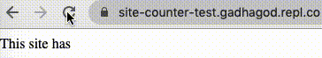
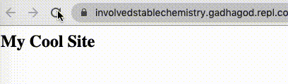
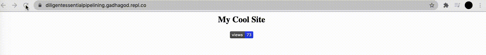

# Site Views
Count and display your site's views with this super lightweight minimal view recorder.

### Summary
**Site Views** is a javascript library to display and count your site's views without any chunky servers or expensive services. In just one HTML line, you can setup your counter. With customizable styles, **you** choose how you want to output content.

### Usage in HTML
##### Add text
Simply insert the following into your document:

    This site has  views.

The above will return the amount of views your site has gotten. Everytime a request is made to your page, the number will go up one.

To style the text returned by the last code block, you can add the url paramter `tag`. For example...

    This site has  views.

This will make a `<strong>` tag, with it's contents being the views. 

You can use css to style these too!

    
    This site has  views.

##### Add badge
To add a badge to your document, add the following to the document:

    <h2>My Cool Site</h2>
    

You can change the color of the badge by adding the URL argument `color`. The supported colors are aqua, black, blue, brighred, brightyellow, fuchsia, gray, green, lightgrey, lime, maroon, navy, olive, orange, purple, red, silver, teal, white, yellow, yellowgreen.

    <h2>My Cool Site</h2>
    

You can center setting the URL argument `center` to `True`.

    

        <h2>My Cool Site</h2>
    

    

